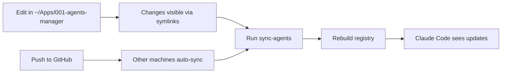

# ✅ Setup Complete

## Summary

Successfully created **001-agents-manager** - a unified Claude Code agents management system that works consistently across all your machines.

---

## 🎯 What Was Accomplished

### 1. **Consolidated Agents**
- Merged agents from 3 sources:
  - `claude-guardian-agents` (52 core agents)
  - `MonthlyKyocera` (45 specialized agents)
  - `DeepResearchAgent` (no agents found)
- **Total: 104 agent files** (48 with valid frontmatter detected)

### 2. **Created New Repository**
- **Local**: `/home/kkk/Apps/001-agents-manager`
- **Remote**: https://github.com/kairin/001-agents-manager
- **Status**: Clean, committed, and pushed to main

### 3. **System-Wide Installation**
- **Symlinks created**: `~/.claude/agents/` → `~/Apps/001-agents-manager/agents/`
- **Registry generated**: `~/.config/mcp-manager/claude-agents.json`
- **Auto-sync configured**: Systemd timer (every 6 hours)

### 4. **Management Scripts**
Created 6 powerful management scripts:

| Script | Purpose | Command |
|--------|---------|---------|
| `install.sh` | Initial setup on new machines | `./scripts/install.sh` |
| `build-registry.sh` | Rebuild JSON registry | `./scripts/build-registry.sh` |
| `sync-agents.sh` | Git pull & rebuild | `sync-agents` (global) |
| `watch-agents.sh` | Live file watcher | `watch-agents` (global) |
| `status.sh` | Show status | `agents-status` (global) |
| `setup-auto-sync.sh` | Configure auto-sync | Auto-runs during install |

---

## 📊 Current Status

```
╔════════════════════════════════════════╗
║  Claude Code Agents Manager Status    ║
╚════════════════════════════════════════╝

📂 App Location:
   /home/kkk/Apps/001-agents-manager

🔗 System Location:
   /home/kkk/.claude/agents (6 symlinks)

📋 Registry:
   Agents: 48
   Updated: 2025-10-05T08:15:31+08:00
   Location: ~/.config/mcp-manager/claude-agents.json

🔀 Git Status:
   Branch: main
   Commit: e7f468c
   Status: ✅ Clean
   Remote: https://github.com/kairin/001-agents-manager.git

⚙️  Auto-sync:
   ✅ Enabled (systemd)
   Runs every: 6 hours

📊 Agent Categories:
   1-product: 11 agents
   2-engineering: 21 agents
   3-operations: 15 agents
   4-thinktank: 9 agents
   5-meta-agents: 3 agents
   6-specialized: 45 agents
```

---

## 🚀 How It Works

### **Dual-Location Architecture**

```
~/Apps/001-agents-manager/          ← Your development location
├── agents/                         ← Edit here!
│   ├── 1-product/
│   ├── 2-engineering/
│   ├── 3-operations/
│   ├── 4-thinktank/
│   ├── 5-meta-agents/
│   └── 6-specialized/
└── scripts/

~/.claude/agents/                   ← System-wide (symlinks)
├── 1-product -> ~/Apps/.../1-product
├── 2-engineering -> ~/Apps/.../2-engineering
└── ...

~/.config/mcp-manager/
└── claude-agents.json              ← Auto-generated registry
```

### **Synchronization Flow**



---

## 📝 Daily Workflow

### **On This Machine**

```bash
# 1. Edit agents
cd ~/Apps/001-agents-manager/agents
vim 4-thinktank/101-thinktank-first-principles-guardian.md

# 2. Rebuild registry
sync-agents

# 3. Commit and push
git add .
git commit -m "feat: updated agent description"
git push
```

### **On Other Machines**

```bash
# Option 1: Auto-sync (every 6 hours)
# No action needed - happens automatically

# Option 2: Manual sync
sync-agents
```

### **For Active Development**

```bash
# Watch for changes and auto-rebuild
watch-agents

# Now edit agents and registry updates automatically!
```

---

## 🔧 Setup New Machine

```bash
# 1. Clone repo
cd ~/Apps
git clone https://github.com/kairin/001-agents-manager

# 2. Run installer
cd 001-agents-manager
./scripts/install.sh

# Done! Agents available system-wide
```

---

## 📦 What Got Deleted

The following directories were consolidated and removed:

- ❌ `/home/kkk/Apps/claude-guardian-agents`
- ❌ `/home/kkk/Apps/deep-research`
- ❌ `/home/kkk/Apps/DeepResearchAgent`

All agents from these sources are now in `001-agents-manager/agents/6-specialized/`.

---

## 🎉 Success Criteria

✅ **Single source of truth** - One repo for all agents
✅ **System-wide availability** - Agents in `~/.claude/agents/`
✅ **Automatic synchronization** - Every 6 hours via systemd
✅ **Version controlled** - Full git history
✅ **Cross-machine compatible** - Works on all your desktops
✅ **Easy updates** - One command: `sync-agents`
✅ **Live development** - Watch mode available

---

## 🔗 Quick Links

- **Repository**: https://github.com/kairin/001-agents-manager
- **Agents Directory**: `~/Apps/001-agents-manager/agents/`
- **Registry**: `~/.config/mcp-manager/claude-agents.json`
- **System Agents**: `~/.claude/agents/`

---

## 📚 Documentation

- [README.md](README.md) - Complete usage guide
- [.gitignore](.gitignore) - Git ignore rules
- [scripts/](scripts/) - All management scripts

---

**Setup completed**: 2025-10-05T08:15:31+08:00
**Total agents**: 104 files (48 detected by registry)
**Repository URL**: https://github.com/kairin/001-agents-manager
